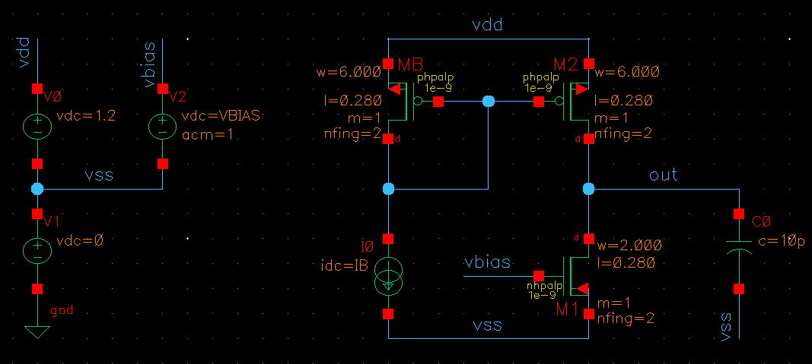
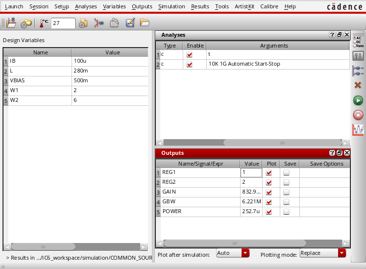

.. _common_source:

***********************************************************
Simulation of a common-source circuit using SOCAD and ADE-L
***********************************************************

This tutorial demonstrates how to use **SOCAD** to simulate a common-source circuit on Cadence Virtuoso from a Python program. It uses the files provided in the `project example <https://github.com/mdmfernandes/socad/tree/master/example>`_.

**SOCAD** is divided in two programs:

* The first program is designated as **SOCAD server** (for simplification). It is responsible to make the bridge between *Cadence Virtuoso* and the **SOCAD client**, executing the tasks required by the **SOCAD client** and returning the results from Cadence.
* The second program is designated as **SOCAD client**. It is responsible to control the Cadence behavior (e.g. update circuit variables values, run simulation, ...), and to receive the simulation results.

.. _section1:

1. Design the circuit and configure the simulation environment
==============================================================

This circuit was designed with the STM 65nm technology, using Cadence Virtuoso IC6.1.7-64b.500.15 and the ADE-L environment.

1.1. Design the circuit
-----------------------
The common-source (CS) circuit is shown below.

After designing the circuit, the circuit parameters to be updated by the **SOCAD client** need to be associated with variables (e.g. width of transistor *M1* is named **W1**, biasing current is named **IB**, and so on). For this specific circuit, the author defined the following variables:

================= =====================================
Parameter         Description              
================= =====================================
W1 [um]           Width of the transistor M1             
W2 [um]           Width of the transistors M2 and MB     
L [um]            Length of all transistors              
IB [A]            Biasing current of the current-mirror  
VBIAS [V]         Biasing voltage of the transistor M1   
================= =====================================

1.2. Configure the simulation environment using *ADE-L*
-------------------------------------------------------

The ADE setup is highly circuit-dependent, and for this circuit is the following:

These are the steps performed to achieve the state shown in the figure:

1. Import the variables to the *ADE-L* (*Variables -> Copy From Cellview*).
2. Define the analysis to perform. In this example the author chose:
    * DC - to get the transistors' operating regions, and the overall power consumption;
    * AC - to get the circuit gain and GBW.
3. Set the simulation outputs, as following:
    * GAIN - ``ymax(mag(v(\"/out\" ?result \"ac\"))``
    * REG1 - ``pv(\"M1.m1\" \"region\" ?result \"dcOpInfo\")``
    * REG2 - ``pv(\"M2.m1\" \"region\" ?result \"dcOpInfo\")``
    * POWER - ``(- pv(\"V0\" \"pwr\" ?result \"dcOpInfo\"))``
    * GBW - ``gainBwProd(mag(v(\"/out\" ?result \"ac\"))) || 0.0``

The DC outputs (REG1, REG2, POWER) are easily obtained from the *Tools -> Results Browser...* menu, and the AC outputs (GAIN, GBW) can be obtained from the *Tools -> Calculator...*.

In the GBW output, the expression ends with ``|| 0.0``. This sub-expression indicates that the GBW default value is 0.0 (with type = float), i.e. if the simulator can't obtain the GBW value, it will assign zero to GBW. This prevents simulation errors that can broke the program. 

After setting the *ADE-L* environment, perform a simulation and be sure that there are no errors and the simulation outputs are correctly displayed. It's also recommended to save the environment state.

2. Generate the OCEAN scripts
=============================

The OCEAN scripts are executed by Cadence, when requested by the **SOCAD client**, and include commands to load the simulator, run a simulation, update the circuit variables. These files are obtained from the *ADE-L* state that was configured in :ref:`Section 1 <section1>`

This is the trickiest part of the configuration. This step comprises two main tasks:

1. Export an OCEAN script with the *ADEL-L* configurations.
2. Split the previous file in three scripts:
    * Load the simulator (in this example is *Spectre*) (*loadSimulator.ocn*);
    * Load the circuit variables before run a simulation (*run.ocn*);
    * Run a simulation and save the outputs to a file (*vars.ocn*).

2.1. Export the OCEAN script
----------------------------
The OCEAN script with the *ADE-L* configuration can be exported from *Session -> Save Ocean Script ...*. For the circuit of this example, it content is the following:

.. code-block:: scheme

    simulator( 'spectre )
    design("CADENCE_WORKSPACE/simulation/COMMON_SOURCE/spectre/schematic/netlist/netlist")
    resultsDir("CADENCE_WORKSPACE/simulation/COMMON_SOURCE/spectre/schematic" )
    modelFile( 
        '("CADENCE_WORKSPACE/nominal/spectre/nominalwrapper.scs" "")
    )
    definitionFile(
        "models.scs"
    )
    analysis('ac ?start "10k"  ?stop "1G"  )
    analysis('dc ?saveOppoint t  )
    desVar(	  "IB" 100u	)
    desVar(	  "L" 0.28	)
    desVar(	  "VBIAS" 500m	)
    desVar(	  "W1" 2	)
    desVar(	  "W2" 6	)
    envOption(
        'analysisOrder  list("dc" "ac") 
    )
    temp( 27 ) 
    run()
    GAIN = ymax(mag(v("/out" ?result "ac")))
    plot( GAIN ?expr '( "GAIN" ) )
    REG1 = pv("M1.m1" "region" ?result "dcOpInfo")
    plot( REG1 ?expr '( "REG1" ) )
    REG2 = pv("M2.m1" "region" ?result "dcOpInfo")
    plot( REG2 ?expr '( "REG2" ) )
    GBW = (gainBwProd(mag(v("/out" ?result "ac"))) || 0.0)
    plot( GBW ?expr '( "GBW" ) )
    POWER = (- pv("V0" "pwr" ?result "dcOpInfo"))
    plot( POWER ?expr '( "POWER" ) )

.. _split_files:

2.2. Split the OCEAN script in multiple files
---------------------------------------------

These files are available provided with the project exemple under the *socad_cadence -> script* directory.

2.2.1. loadSimulator.ocn
^^^^^^^^^^^^^^^^^^^^^^^^

This script includes the definition of the simulator (*spectre*), the netlist and results directories, the file with the devices models, and the analysis to perform. One only needs to load this file once per program execution, usually at the begin of the program.

.. code-block:: scheme

    ; Set up the number notation, precision, etc, of the results
    setup(?numberNotation 'engineering)

    ; Simulator and design folders
    simulator( 'spectre )
    design("CADENCE_WORKSPACE/simulation/COMMON_SOURCE/spectre/schematic/netlist/netlist")
    resultsDir("CADENCE_WORKSPACE/simulation/COMMON_SOURCE/spectre/schematic" )
    modelFile( 
        '("CADENCE_WORKSPACE/nominal/spectre/nominalwrapper.scs" "")
    )
    definitionFile(
        "models.scs"
    )

    ; Analysis to perform
    analysis('ac ?start "10k"  ?stop "1G"  )
    analysis('dc ?saveOppoint t  )
    envOption(
        'analysisOrder  list("dc" "ac") 
    )

    ; Other settings
    temp( 27 ) 

The only parameter that is not included in the original script file is the ``setup(?numberNotation 'engineering)``, which changes the number notation to engineering. More info about this command can be found in the Cadence help documentation [CDCHELP]_.

2.2.2. run.ocn
^^^^^^^^^^^^^^
This file runs the simulation, get the results and store them in the *SOCAD_RESULT_FILE*.

.. code-block:: scheme

    run()   ; run a simulation

    ; Output file
    out_file = getShellEnvVar("SOCAD_RESULT_FILE")
    outf = outfile(out_file "w")

    ; Simulation results
    GAIN = ymax(mag(v("/out" ?result "ac")))
    REG1 = pv("M1.m1" "region" ?result "dcOpInfo")
    REG2 = pv("M2.m1" "region" ?result "dcOpInfo")
    GBW = (gainBwProd(mag(v("/out" ?result "ac"))) || 0.0)
    POWER = (- pv("V0" "pwr" ?result "dcOpInfo"))

    ; Save results to file
    fprintf( outf "%s\t%g\n", "GAIN", GAIN)
    fprintf( outf "%s\t%d\n", "REG1", REG1)
    fprintf( outf "%s\t%d\n", "REG2", REG2)
    fprintf( outf "%s\t%g\n", "GBW", GBW)
    fprintf( outf "%s\t%e\n", "POWER", POWER)

    close(outf) ; Close the file

The format specifiers (e.g. ``%d``) of the ``fprintf`` function must be chosen according to the respective result's data type. In doubt, one can use the function ``float(<result>)`` to convert the result to float, and then use the ``%f`` or ``%g`` specifier. If the wrong specifier is provided, the Cadence will trigger an error. More info about the used functions can be found on the Cadence help documentation [CDCHELP]_.

2.2.3. vars.ocn
^^^^^^^^^^^^^^^
This file includes the circuit design variables.

.. code-block:: scheme
    
    desVar(   "IB" 100u    )
    desVar(   "L" 0.28     )
    desVar(   "VBIAS" 500m )
    desVar(   "W1" 2       )
    desVar(   "W2" 6       )

3. Run the program
==================

The program is started in two steps:

1. Start the **SOCAD server**, which should be located in the machine where *Cadence Virtuoso* is installed.
2. Start the **SOCAD client**, which can be in any machine that reach the **SOCAD server**, or in the same machine, depending to the chosen socket type (more info about the sockets can be found in the :ref:`Library Reference <library_reference>`).

**NOTE:** It is mandatory to run the **SOCAD server** before the **SOCAD client**!!!

3.1. SOCAD server
-----------------

.. _config_server:

3.1.1. Configure the server
^^^^^^^^^^^^^^^^^^^^^^^^^^^

The **SOCAD server** configurations are in the file *start_cadence.sh* located in the directory *socad_cadence* from the `project example <https://github.com/mdmfernandes/socad/tree/master/example>`_. This file is responsible to create the required variables, directories and files, and runs *Cadence Virtuoso*. The following variables can be changed by the user:

* ``SOCAD_PROJECT_NAME="project_example"`` - project name and directory
* ``SOCAD_WORK_SPACE="/home/example/project_ws"`` - project work space, i.e. the directory that contains the project directory.
* ``SOCAD_CLIENT_ADDR="localhost"`` - IP address of the **SOCAD client**.
* ``SOCAD_CLIENT_PORT="4000"`` - port of the **SOCAD client**.

3.1.2. Run the server
^^^^^^^^^^^^^^^^^^^^^

1. Copy the directory *socad_cadence*, located in the `project example <https://github.com/mdmfernandes/socad/tree/master/example>`_, to the machine where *Cadence Virtuoso* is installed.
2. Replace the files in the *socad_cadence/script* folder for the ones generated in :ref:`Section 2.2 <split_files>`.
3. Run the *start_cadence.sh* script with the command ``sh start_cadence.sh``. If it's the first time that the program is executed for a project, the folder *SOCAD_WORK_SPACE/SOCAD_PROJECT_NAME* described in :ref:`Section 3.1.1. <config_server>` is created and the folder *socad_cadence/script* is copied to that folder. If further modifications to the scripts are required, they should be made in the new *script* folder, i.e. *SOCAD_WORK_SPACE/SOCAD_PROJECT_NAME/script*.

If the program is started successfully, the terminal should present the following message in the last line:

.. code-block:: text

    [INFO] Cadence is connected to server! Waiting for a connection from the client...

This means that the **SOCAD server** is connected to *Cadence Virtuoso* and is waiting for a connection from the **SOCAD client**.

3.2. SOCAD client
-----------------

3.2.1. Configure the client
^^^^^^^^^^^^^^^^^^^^^^^^^^^

The **SOCAD client** configurations are only regarding the **SOCAD server** IP and port, and can be modified on the ``main()`` function of the *socad_example.py* module on the `project example <https://github.com/mdmfernandes/socad/tree/master/example>`_, where:

* ``host = "localhost"`` - IP address of the **SOCAD server**.
* ``port = 4000`` - port of the **SOCAD server**.

3.2.2. Run the client
^^^^^^^^^^^^^^^^^^^^^

The **SOCAD client** is executed with the command ``python socad_example.py``. If the program is started successfully, the terminal output should be similar to:

.. code-block:: text

    mdmfernandes@EXAMPLE:~socad/example$ python socad_example.py

    <license header>

    Starting client...
    Connecting to server...
    [INFO] Connected to server with the address 127.0.0.1:46434

    ############### SOCAD EXAMPLE ###############
    1 - Load simulator
    2 - Update variables and run a simulation
    0 - Exit.

    -> Please Select: 

This means that the **SOCAD client** is connected to the **SOCAD server**. The **SOCAD server** also displays an info message:

.. code-block:: text

    [INFOs] Connected to client with address 127.0.0.1:51912

4. Running example
==================

This section shows a typical execution of SOCAD. After starting both the **SOCAD server** and **SOCAD client** successfully, one may load the simulator and then run simulations.

**NOTE**: The simulator should de loaded before running a simulation, otherwise *Cadence* will trigger an error and the program will terminate. Also, this can erase all circuit variables from the *vars.ocn* file.

4.1. Load the simulator
-----------------------

The simulator is loaded from the file *loadSimulator.ocn*, through *Cadence Virtuoso*, after choosing the option **1** on the **SOCAD client**. If everything goes well, *Cadence* sends the message **loadSimulator_OK** to the **SOCAD server**. When the **SOCAD server** receives this message, it sends the circuit design variables, stored in the file *vars.ocn*, to the **SOCAD client**. The **SOCAD client** terminal output is similar to:

.. code-block:: text

    ############### SOCAD EXAMPLE ###############
    1 - Load simulator
    2 - Update variables and run a simulation
    0 - Exit.

    -> Please Select: 1

    Simulator loaded with success! Received variables:
    Variable: VBIAS - Value: 0.55
    Variable: IB - Value: 0.00011
    Variable: L - Value: 0.308
    Variable: W1 - Value: 2.2
    Variable: W2 - Value: 6.6

4.2. Update variables and run a simulation
------------------------------------------

To simulate that the circuit design variables were updated (e.g. by a circuit optimizer), the **SOCAD client** increases their value by 10% when it receives the simulation results from the **SOCAD server**.

By selecting the option **2** on the **SOCAD client**, the *Cadence* will start a simulation (the simulation log is shown on the **SOCAD server** terminal output). If the simulation is successful, it sends the message **updateAndRun_OK** to the **SOCAD server**, which in turn sends the simulation results, stored in the file *SOCAD_RESULT_FILE*, to the **SOCAD client**. The **SOCAD client** terminal output is similar to:

.. code-block:: text

    ############### SOCAD EXAMPLE ###############
    1 - Load simulator
    2 - Update variables and run a simulation
    0 - Exit.

    -> Please Select: 2

    Sending updated variables...
    Key: VBIAS - Val:0.5
    Key: IB - Val:0.0001
    Key: L - Val:0.28
    Key: W1 - Val:2.0
    Key: W2 - Val:6.0

    Received updateAndRun from Cadence
    Simulation results: {'GBW': 6221070.0, 'REG2': 2.0, 'GAIN': 0.832934, 'POWER': 0.0002527307, 'REG1': 1.0}

4.3. Exit from SOCAD
--------------------

By selecting the option **0** on the **SOCAD client**, both **SOCAD** and *Cadence Virtuoso* are terminated. The **SOCAD server** terminal outputs the message ``Server has stopped with the exit code 0. I'm out!!!`` and the **SOCAD client** terminal outputs the message ``**** Closing socket and ending program... Bye! ****``.

References
==========
.. [CDCHELP] The Cadence Virtuoso help documentation can be accessed through the program, in *Help -> User Guide*.